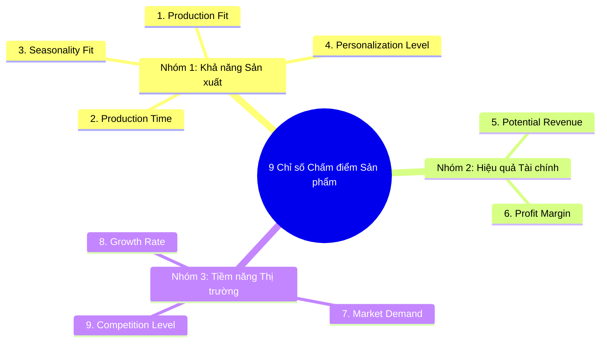

# PRINTWAY SHARING – PRODUCT OPPORTUNITY HUB
> **Tài liệu tổng hợp & chuyển đổi cấu trúc từ Video Mini-Series: Printway Sharing**  
> **Chủ đề:** Đề bài số 1 – Giải pháp Nghiên cứu & Phát triển Sản phẩm (Product Opportunity Hub) cho ngành Print On Demand (POD) / Cross-Border E-Commerce.  
> **Diễn giả:** Ms. Lan Hưng – CMO Printway.

---

## 📌 MỤC LỤC
1. [Giới thiệu Chung & Tổng quan Printway](#1-giới-thiệu-chung--tổng-quan-printway)
2. [Tổng quan về Mô hình POD & Quy mô Thị trường](#2-tổng-quan-về-mô-hình-pod--quy-mô-thị-trường)
3. [Vòng đời Sản phẩm trong Ngành POD (Product Lifecycle)](#3-vòng-đời-sản-phẩm-trong-ngành-pod-product-lifecycle)
4. [Nhiệm vụ & Quy trình Làm việc của Team R&D (R&D Workflow)](#4-nhiệm-vụ--quy-trình-làm-việc-của-team-rd-rd-workflow)
5. [3 Khó khăn Thực tế Của Team R&D & Seller](#5-3-khó-khăn-thực-tế-của-team-rd--seller)
6. [Bộ Khái niệm Căn bản trong Nghiên cứu Sản phẩm POD](#6-bộ-khái-niệm-căn-bản-trong-nghiên-cứu-sản-phẩm-pod)
7. [Bộ 9 Chỉ số Chấm điểm Đánh giá Sản phẩm](#7-bộ-9-chỉ-số-chấm-điểm-đánh-giá-sản-phẩm)
8. [Yêu cầu Đầu ra Cho Đề bài "Product Opportunity Hub"](#8-yêu-cầu-đầu-ra-cho-đề-bài-product-opportunity-hub)

---

## 1. Giới thiệu Chung & Tổng quan Printway

### 1.1 Mục đích Đề bài
Đề bài số 1 trong cuộc thi **AI Hackathon** xuất phát từ bài toán thực tế mà đội ngũ R&D của Printway và các nhà bán hàng (sellers) thương mại điện tử xuyên biên giới (Cross-border E-commerce) đang gặp phải. 

Mục tiêu là tìm kiếm giải pháp **Product Opportunity Hub** giúp tự động hóa, tối ưu hóa quy trình nghiên cứu và phát triển sản phẩm POD.

### 1.2 Giới thiệu về Printway
* **Vị thế:** Nền tảng Print On Demand (POD) toàn cầu, cung cấp giải pháp trọn gói từ sản xuất (fulfillment), kết nối gian hàng trực tuyến và đồng hành cùng seller.
* **Kinh nghiệm:** Hơn 7 năm hoạt động trong ngành.
* **Quy mô nhân sự:** 300+ nhân sự hiện diện trên 6 quốc gia.
* **Năng lực sản xuất:** Danh mục hơn 1.000+ sản phẩm, công suất lên tới **150.000 sản phẩm/ngày**.
* **Hệ thống Nhà in (Fulfillment Centers):** Sở hữu xưởng in trực tiếp tại Mỹ (US), Việt Nam và mạng lưới nhà in đối tác tại Châu Âu, Châu Úc, Trung Quốc, Canada...
* **Tích hợp Nền tảng:** Kết nối trực tiếp với 6+ sàn TMĐT lớn: Etsy, Amazon, Shopify, Walmart, WooCommerce, TikTok Shop.
* **Đối tác Chiến lược:** Amazon Global Selling, Google, Walmart, cùng các cổng thanh toán uy tín như Payoneer, LianLian, WorldFirst...

---

## 2. Tổng quan về Mô hình POD & Quy mô Thị trường

### 2.1 Mô hình Print On Demand (POD) là gì?
* **Khái niệm:** POD là mô hình thương mại điện tử mà sản phẩm chỉ được sản xuất **sau khi khách hàng chốt đơn**.
* **Đặc điểm cốt lõi:**
  * **Không tồn kho:** Seller không cần lưu giữ hay quản lý hàng tồn kho, giảm tối đa rủi ro vốn.
  * **Cá nhân hóa (Personalization):** Sản phẩm thường được in ấn, khắc tên/hình ảnh theo yêu cầu riêng của từng khách hàng.
  * **Chuỗi vận hành:** Sản phẩm được sản xuất và chuyển trực tiếp từ xưởng in (Printway) tới tay người tiêu dùng cuối (End-consumer).

### 2.2 Quy mô & Tốc độ Tăng trưởng Thị trường POD Toàn cầu

| Chỉ số / Thị trường | Số liệu & Dự báo |
| :--- | :--- |
| **Định giá năm 2025** | 10.8 tỷ USD |
| **Dự báo năm 2026** | 13.1 tỷ USD |
| **Dự báo năm 2033** | 57.5 tỷ USD |
| **Tốc độ tăng trưởng (CAGR)** | **23.6%/năm** |
| **Thị trường trọng điểm** | Bắc Mỹ chiếm **36%** thị phần doanh thu (2025) |
| **Phân khúc Quần áo (Apparel)** | Chiếm thị phần lớn nhất (**39.5%** cơ cấu doanh thu) |
| **Phân khúc Trang trí nhà cửa (Home Decor)** | Tăng trưởng nhanh nhất (**24.5%/năm**) – Thế mạnh cốt lõi của Printway |

---

## 3. Vòng đời Sản phẩm trong Ngành POD (Product Lifecycle)

Vòng đời của một sản phẩm POD trải qua **5 giai đoạn chính**:

1. **Conception (Hình thành ý tưởng):**
   * Bắt các tín hiệu sớm từ mạng xã hội (Pinterest, TikTok, X/Twitter, Facebook, Instagram).
   * Theo dõi xu hướng giải trí, trào lưu DIY (Do-It-Yourself), Crafting, tin tức thời sự.
   * Phân tích dữ liệu bán hàng mùa vụ, sự kiện, các báo cáo trend từ các sàn TMĐT.
2. **Product Launch (Ra mắt sản phẩm):**
   * Biến ý tưởng thành danh sách sản phẩm (listing) trên các sàn TMĐT.
   * Chạy chiến dịch kiểm thử (testing) để đánh giá phản hồi của người tiêu dùng.
3. **Growth (Tăng trưởng):**
   * Phát hiện sản phẩm chiến thắng (winning product).
   * Mở rộng quy mô quảng cáo (scale) để tối đa hóa doanh thu.
   * Đơn hàng được đẩy tự động sang đơn vị fulfillment (Printway) để sản xuất với chất lượng cao và giao hàng đúng thời gian quy định của sàn.
4. **Maturity (Bão hòa):**
   * Xuất hiện sự cạnh tranh gay gắt từ nhiều đối thủ có listing tương tự.
   * Seller phải gia tăng ngân sách quảng cáo (Ads) để duy trì vị thế cạnh tranh.
5. **Decline (Suy thoái):**
   * Nhu cầu thị trường giảm mạnh.
   * Seller triển khai các chương trình khuyến mãi/ưu mại (promotions) để giải quyết lượng tồn hàng cuối trước khi ngừng bán.

---

## 4. Nhiệm vụ & Quy trình Làm việc của Team R&D (R&D Workflow)

Một đội ngũ R&D (Research & Development) trong ngành POD chịu trách nhiệm thực hiện 6 đầu việc chính:

1. **Nghiên cứu Thị trường & Đối thủ:** Tìm hiểu thị trường target, đối thủ cạnh tranh, chất liệu và tiềm năng phát triển của các ngách sản phẩm.
2. **Phân tích Dữ liệu Hiệu suất:** Đo lường các chỉ số tăng trưởng, doanh thu và hiệu quả bán hàng để đề xuất ý tưởng tối ưu hoặc cải tiến sản phẩm.
3. **Sáng tạo Ý tưởng Sản phẩm & Thiết kế:** Theo dõi trend qua các kênh TMĐT và MXH để tạo ra idea sản phẩm/thiết kế mới áp dụng vào thực tế.
4. **Xác định Niche & Định vị:** Xác định ngách hàng, đối tượng khách hàng mục tiêu và vị trí của sản phẩm trên thị trường.
5. **Làm việc với Đơn vị Fulfillment:** Kết nối với nhà sản xuất (như Printway) để tối ưu chi phí giá vốn (COGS), đảm bảo chất lượng in và nguyên vật liệu phù hợp.
6. **Phối hợp với Đội ngũ Designer:** Chuyển giao ý tưởng nghiên cứu thành các file thiết kế thực tế sẵn sàng cho việc sản xuất và đưa lên listing.

---

## 5. 3 Khó khăn Thực tế Của Team R&D & Seller

Printway chỉ ra 3 điểm nghẽn (pain points) lớn nhất mà các team R&D và Seller đang đối mặt:

### ❌ 1. Bất đồng bộ về Tên gọi Sản phẩm (Product Naming Variation)
Một sản phẩm thực tế có thể mang rất nhiều tên gọi/từ khóa khác nhau trên từng kênh:
* **Tên kỹ thuật tại Nhà sản xuất (Printway):** `Custom Shape Acrylic Ornament`
* **Tên tối ưu SEO trên Etsy:** `Personalized Grandpa Acrylic Ornament Gift`
* **Hậu quả:** Gây tốn rất nhiều thời gian và công sức trong việc tổng hợp, gom nhóm dữ liệu và đo lường hiệu quả bán hàng thực sự của một dòng sản phẩm.

### ❌ 2. Công cụ Phân tích Rời rạc & Phân mảnh
* Mỗi sàn TMĐT hiện nay lại sử dụng một công cụ phân tích riêng (Ví dụ: **Helium 10** cho Amazon, **Aura** cho Etsy...).
* Các công cụ này chỉ hoạt động độc lập trên từng sàn, chưa tích hợp đa nguồn và **chưa đưa ra được câu trả lời trực tiếp**: *"Sản phẩm này có nên sản xuất/bán hay không?"*

### ❌ 3. Quy trình Vận hành Thủ công, Thiếu Tự động hóa
* Các khâu thu thập dữ liệu số liệu từ mạng xã hội, sàn TMĐT, website đều làm thủ công.
* Chưa có quy trình tự động xuất báo cáo nghiên cứu thị trường, đề xuất ngách, xu hướng thiết kế hay gợi ý nguyên vật liệu mới.

---

## 6. Bộ Khái niệm Căn bản trong Nghiên cứu Sản phẩm POD

Để xây dựng thuật toán và giải pháp, các đội thi cần nắm rõ hệ thống khái niệm chuẩn sau:

| Khái niệm | Định nghĩa | Ví dụ minh họa |
| :--- | :--- | :--- |
| **Niche (Ngách thị trường)** | Phân khúc thị trường nhỏ được xác định theo sở thích, đam mê, nghề nghiệp hoặc chủ đề cụ thể. | `Cat Lover` (Người yêu mèo), `Teacher` (Giáo viên), `Nurse` (Y tá), `Memorial` (Tưởng niệm)... |
| **Seasonality (Tính Mùa vụ)** | Các dịp lễ, mùa hoặc cột mốc sự kiện có nhu cầu mua sắm tăng đột biến. | `Christmas` (Giáng sinh), `Halloween`, `Mother's Day`, `Birthday`, `Wedding`... |
| **Product Category (Ngành hàng)** | Hệ thống phân loại danh mục sản phẩm theo cấp bậc cấu trúc. | Trong ngành `Home & Living` có các ngành hàng con như `Outdoor & Gardening`, `Kitchen & Dining`... |
| **Product Type (Loại sản phẩm)** | Đơn vị sản phẩm cụ thể gắn liền với quy trình sản xuất, chất liệu và cấu trúc giá vốn. | `Acrylic Block`, `Wooden Sign`, `Ceramic Ornament`, `Metal Sign`... |
| **SKU (Stock Keeping Unit)** | Mã định danh duy nhất cho từng biến thể cụ thể (chất liệu, màu sắc, kích thước, số lớp, kiểu in, mã fulfillment). | Ví dụ mã chuẩn: `PW-PCS-WOOD-2L-18x18` *(Printway - Personal Life Celebration Sign - Chất liệu Gỗ - 2 lớp - Kích thước 18x18 inch)*. |

---

## 7. Bộ 9 Chỉ số Chấm điểm Đánh giá Sản phẩm

Printway gợi ý **9 chỉ số trọng yếu** chia làm **3 nhóm chính** mà một công cụ R&D cần chấm điểm để đánh giá tiềm năng sản phẩm:

###  nhóm 1: Khả năng Sản xuất (Production Capability)
1. **Production Fit (Khả năng sản xuất):** Đánh giá xưởng (Printway) có làm được sản phẩm này không? Xem xét tính sẵn có của nguyên vật liệu, công nghệ in, độ khó gia công và tỷ lệ lỗi dự kiến.
2. **Production Time (Thời gian sản xuất):** Tổng số ngày từ khi nhận đơn đến khi giao tới tay khách hàng.
3. **Seasonality Fit (Thời điểm mùa vụ):** Đánh giá mức độ phù hợp thời gian hiện tại. Liệu có còn đủ thời gian để thiết kế, niêm yết (launching) và chạy thử nghiệm (testing) trước khi mùa lễ kết thúc hay không?
4. **Personalization Level (Khả năng cá nhân hóa):** Mức độ tùy biến (tên, ảnh, lời chúc...) và phương thức thực hiện (in UV, khắc laser, dập nổi...).

### Nhóm 2: Hiệu quả Tài chính (Financial Performance)
5. **Potential Revenue (Doanh thu tiềm năng):** Dự báo doanh thu trong một khoảng thời gian nhất định (dựa vào dữ liệu lịch sử/cùng kỳ năm ngoái).
6. **Profit Margin (Biên lợi nhuận):** Phần lợi nhuận còn lại sau khi lấy Giá bán trừ đi Giá vốn sản xuất (COGS), Phí vận chuyển (Shipping cost) và các Phí sàn/vận hành liên quan.

### Nhóm 3: Tiềm năng Thị trường (Market Opportunity)
7. **Market Demand (Nhu cầu thị trường):** Đo lường lượng tìm kiếm (Search volume), lượt bán (Sales count), lượt yêu thích (Favorites), và mức độ phủ sóng trên truyền thông.
8. **Growth Rate (Tốc độ tăng trưởng):** Tốc độ tăng trưởng từ khóa, listing và doanh số theo thời gian (giúp xác định thị trường đang tăng trưởng hay đã đi vào suy thoái).
9. **Competition Level (Mức độ cạnh tranh):** Số lượng listing hiện có, số lượng seller mới gia nhập và độ trùng lặp thiết kế trên thị trường.

---

## 8. Yêu cầu Đầu ra Cho Đề bài "Product Opportunity Hub"

### 8.1 Mục tiêu Cốt lõi
Xây dựng một **công cụ/nền tảng tự động** hỗ trợ đội ngũ R&D phát hiện và gợi ý các sản phẩm tiềm năng – đáp ứng đồng thời 2 điều kiện: **Khả thi về sản xuất** và **Đúng nhu cầu thị trường**.

### 8.2 4 Yêu cầu Kỹ thuật Cần Đạt
1. **Tổng hợp & Phát hiện Tiềm năng:** Tự động thu thập và tích hợp dữ liệu từ đa nguồn (MXH, Sàn TMĐT, Website) để phát hiện các tín hiệu sản phẩm tiềm năng.
2. **Ghép nối Dữ liệu (Listing Mapping):** Ghép nối (map) thành công các listing đa dạng trên sàn TMĐT về đúng loại sản phẩm/SKU tương ứng trong Catalog sản xuất của Printway (hoặc đơn vị fulfillment).
3. **Hệ thống Chấm điểm & Đưa ra Quyết định (Product Scoring & Decision):** Chấm điểm tự động theo Bộ 9 chỉ số và đưa ra kết luận rõ ràng:
   * 🟢 *Nên sản xuất / Nên bán*
   * 🔴 *Không nên sản xuất / Không nên bán*
4. **Báo cáo Tự động & Dự báo Xu hướng (Auto Reporting & Forecasting):** Tự động xuất báo cáo đề xuất ngách bán hàng (Niche), nguyên vật liệu phù hợp, thời điểm ra mắt tối ưu và dự báo trend tương lai.

---
*Tài liệu được chuẩn hóa và cấu trúc lại từ Video Mini-Series Printway Sharing.*
