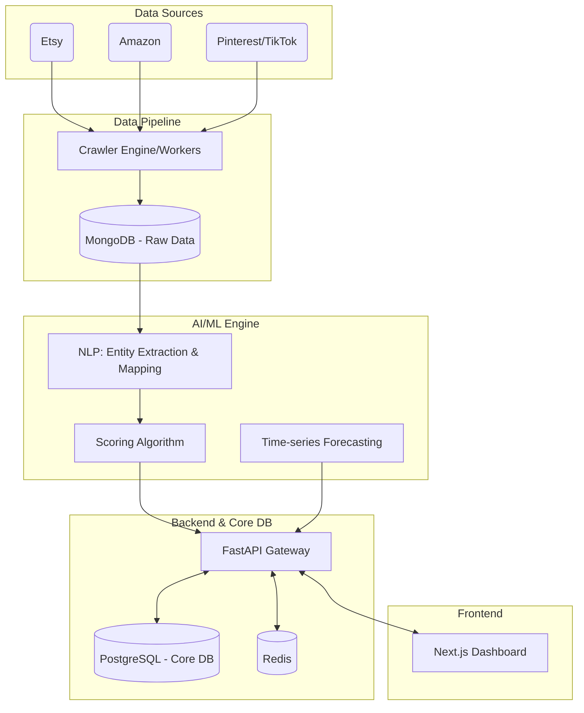

# Product Requirements Document (PRD) - Product Opportunity Hub

## 1. Thông tin chung (Overview)
* **Tên sản phẩm:** Product Opportunity Hub (POH)
* **Loại ứng dụng:** Web Application / SaaS Dashboard
* **Mục đích:** Xây dựng giải pháp công nghệ tổng thể nhằm số hóa và tự động hóa toàn bộ quy trình R&D (Nghiên cứu & Phát triển sản phẩm) cho mảng Print-On-Demand (POD). Giải quyết bài toán chuẩn hóa dữ liệu đa nguồn và cung cấp quyết định "Nên/Không nên sản xuất" tự động dựa trên thuật toán.

---

## 2. Giải pháp Công nghệ & Tech Stack
Để đảm bảo xử lý được dữ liệu lớn (Big Data) từ Crawler và tính toán mô hình AI/ML hiệu quả, hệ thống sử dụng các công nghệ sau:

* **Frontend:** Next.js (React), Tailwind CSS, Ant Design (hoặc MUI) cho UI/UX Dashboard trực quan, tốc độ load nhanh và chuẩn SEO nội bộ.
* **Backend:** 
  * *Core API:* **Python (FastAPI)** - Lựa chọn hàng đầu để tích hợp mượt mà với các module AI/ML/Data Science.
  * *Data Pipeline & Crawler Worker:* Python (Celery, Scrapy, BeautifulSoup, Selenium/Playwright).
* **Database (Cơ sở dữ liệu):**
  * *Relational DB:* **PostgreSQL** (Lưu trữ User, Product Catalog gốc của Printway, Cấu hình trọng số, Lịch sử phân tích).
  * *NoSQL DB:* **MongoDB** (Lưu trữ dữ liệu phi cấu trúc: Raw listings crawled từ Amazon, Etsy, MXH...).
  * *Caching & Message Broker:* **Redis** (Cache API response, quản lý hàng đợi cho Celery Task).
* **AI & Machine Learning:**
  * *NLP / Text Mapping:* HuggingFace (Transformers), Spacy, hoặc tích hợp API của các LLM (OpenAI/Gemini) để xử lý Listing Mapping và trích xuất thực thể (NER).
  * *Trend Forecasting:* Prophet (của Meta) hoặc ARIMA cho việc dự báo chu kỳ thời gian (Time-series).
* **DevOps & Cloud:** AWS hoặc Google Cloud (GCP). Ứng dụng Docker & Kubernetes (K8s) để auto-scale khi lượng Crawler data tăng đột biến.

---

## 3. Kiến trúc Hệ thống (System Architecture)

---

## 4. Sơ đồ Luồng người dùng (User & UI Flow)

### Flow 1: Khám phá Ngách / Xu hướng (Niche Discovery)
1. **User** đăng nhập vào hệ thống.
2. Điều hướng tới màn hình **"Trending Niches"**.
3. Hệ thống hiển thị danh sách top ngách đang tăng trưởng (được cập nhật hàng ngày).
4. User click vào một ngách cụ thể $\rightarrow$ Xem biểu đồ dự báo Trend (Forecasting) và danh sách các sản phẩm (Listings) tiêu biểu thuộc ngách đó.

### Flow 2: Đánh giá một Keyword / Listing bất kỳ
1. **User** nhập URL của một listing (từ Etsy/Amazon) hoặc nhập một từ khóa (keyword) vào thanh tìm kiếm.
2. **Backend** gửi task cho Crawler (nếu URL mới) hoặc query từ Database.
3. **AI Engine** thực hiện Mapping Listing $\rightarrow$ Chuẩn hóa về Product Type của Printway.
4. **Scoring Engine** tính toán 9 chỉ số chấm điểm.
5. Hiển thị kết quả chi tiết: Tổng điểm, Breakdown (Sản xuất, Tài chính, Thị trường), và Cờ Quyết định (🟢 Nên sản xuất / 🔴 Không nên sản xuất).

### Flow 3: Quản trị Cấu hình Điểm (Admin Flow)
1. **Admin** truy cập màn hình **"Scoring Config"**.
2. Xem danh sách 9 chỉ số.
3. Thay đổi trọng số (Weight) bằng thanh trượt (Slider) (Tổng = 100%).
4. Lưu cấu hình $\rightarrow$ Hệ thống tự động apply công thức mới cho các lần tính toán sau.

---

## 5. Chi tiết Chức năng & Phân tích CRUD

| Module / Chức năng | Phân loại CRUD | Mô tả chi tiết |
| :--- | :---: | :--- |
| **Authentication & Users** | R, U, D | Đăng nhập/Đăng xuất (JWT). Quản lý Role: Admin, R&D Staff, Seller. |
| **Dashboard Statistics** | R | Hiển thị Overview: Tổng số listing đã quét, top keyword/niche tuần qua. |
| **Product Scoring System** | C, R | Nhập input $\rightarrow$ AI chấm điểm $\rightarrow$ Lưu lịch sử chấm điểm (Create). Xem lại kết quả (Read). |
| **Scoring Weights Config** | R, U | (Chỉ Admin) Đọc và Cập nhật trọng số của 9 chỉ số đánh giá. |
| **Listing Mapping Management** | R, U | AI tự động map, nhưng hệ thống cho phép User/Admin sửa (Update) lại nếu AI map sai SKU đích. |
| **Reports & Export** | C, R, D | Xuất báo cáo dạng file PDF/Excel (Create), xem danh sách báo cáo (Read), Xóa file rác (Delete). |

---

## 6. Thiết kế Cơ sở dữ liệu (Database Schema)

*Lưu ý: Dưới đây là các bảng cốt lõi (Core Tables) trong PostgreSQL.*

### 6.1. Bảng `users`
- `id` (PK, UUID)
- `email` (String, Unique)
- `password_hash` (String)
- `role` (Enum: admin, r_and_d, seller)
- `created_at`, `updated_at` (Timestamp)

### 6.2. Bảng `product_catalog` (Catalog chuẩn của Printway)
- `id` (PK, UUID)
- `sku_code` (String, Unique) - Vd: *PW-PCS-WOOD-2L-18x18*
- `product_type` (String)
- `material` (String)
- `base_cost` (Decimal) - COGS (Giá vốn)
- `production_time_days` (Int)
- `personalization_support` (Boolean)

### 6.3. Bảng `scoring_weights_config` (Cấu hình trọng số)
- `id` (PK, UUID)
- `production_fit_w` (Float)
- `production_time_w` (Float)
- `potential_revenue_w` (Float)
- `market_demand_w` (Float)
- *(...các chỉ số khác tương tự)*
- `updated_by` (FK -> users.id)
- `updated_at` (Timestamp)

### 6.4. Bảng `product_evaluations` (Lịch sử chấm điểm)
- `id` (PK, UUID)
- `user_id` (FK -> users.id)
- `keyword_or_url` (String)
- `mapped_sku_id` (FK -> product_catalog.id)
- `total_score` (Float)
- `decision_flag` (Enum: RECOMMEND, REJECT)
- `details_json` (JSONB) - Lưu chi tiết điểm 9 tiêu chí.
- `created_at` (Timestamp)

---

## 7. Danh sách API Cốt lõi (Core APIs)

Tất cả API tuân thủ chuẩn RESTful, trả về định dạng JSON, có tiền tố `/api/v1/`.

1. **Auth:**
   - `POST /auth/login`: Trả về JWT Access Token.
2. **Dashboard & Trends:**
   - `GET /trends/top-niches`: Lấy danh sách ngách đang hot. Param: `?timeframe=7d&limit=10`.
   - `GET /trends/forecast/{niche_id}`: Lấy data vẽ biểu đồ Time-series dự báo.
3. **Scoring & Evaluation:**
   - `POST /evaluations/score`: Body `{ "input_type": "url", "value": "https://..." }`. Trả về chi tiết điểm số, Mapped SKU, và Quyết định.
   - `GET /evaluations/history`: Lấy lịch sử người dùng đã kiểm tra.
4. **Configuration (Admin only):**
   - `GET /config/weights`: Lấy bộ trọng số hiện tại.
   - `PUT /config/weights`: Cập nhật trọng số.
5. **Catalog & Mapping:**
   - `PUT /evaluations/{id}/remap`: Sửa lại kết quả AI mapping (nếu cần thiết), map lại về SKU khác.

---

## 8. Các yêu cầu về AI/ML (AI/ML Requirements)

Để giải quyết bài toán cốt lõi, đội ngũ Data/AI cần xử lý các tasks:
1. **Named Entity Recognition (NER) & NLP:** Huấn luyện hoặc fine-tune mô hình NLP để trích xuất các thông tin từ đoạn text (Listing title, description) bao gồm: *Chất liệu*, *Chủ đề (Niche)*, *Kích thước*, *Từ khóa SEO*.
2. **Semantic Text Similarity:** Sử dụng Embeddings (vd: Sentence-Transformers) để so sánh chuỗi mô tả của sản phẩm thu thập được với danh mục sản phẩm (Catalog) của Printway nhằm ghép nối (Listing Mapping) chính xác nhất.
3. **Thuật toán Chấm điểm (Rule-based + ML):** 
   - Điểm *Sản xuất* và *Tài chính* dựa trên Rule-based (So khớp logic với DB Catalog).
   - Điểm *Thị trường* có thể dùng ML để tính toán percentile (phần trăm xếp hạng) so với tổng thể thị trường.

---

## 9. Triển khai & CI/CD (DevOps)

- **Version Control:** Quản lý source code qua GitHub/GitLab.
- **Containerization:** Đóng gói toàn bộ Frontend, Backend, AI service, Crawler bằng **Docker**.
- **Orchestration:** Quản lý deploy và scale bằng **Kubernetes**. Đặc biệt Crawler workers cần auto-scale khi lượng keyword tìm kiếm đẩy vào queue tăng cao.
- **CI/CD Pipeline:** Sử dụng GitHub Actions.
  - Tự động chạy Unit Test, Linting khi có Pull Request.
  - Tự động build Docker Image và deploy lên môi trường Staging/Production khi merge vào nhánh chính.
- **Monitoring:** Tích hợp Prometheus & Grafana để giám sát sức khỏe server (CPU, RAM của AI Engine) và tracking log API.
