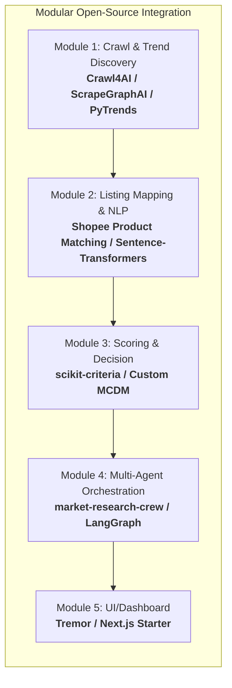
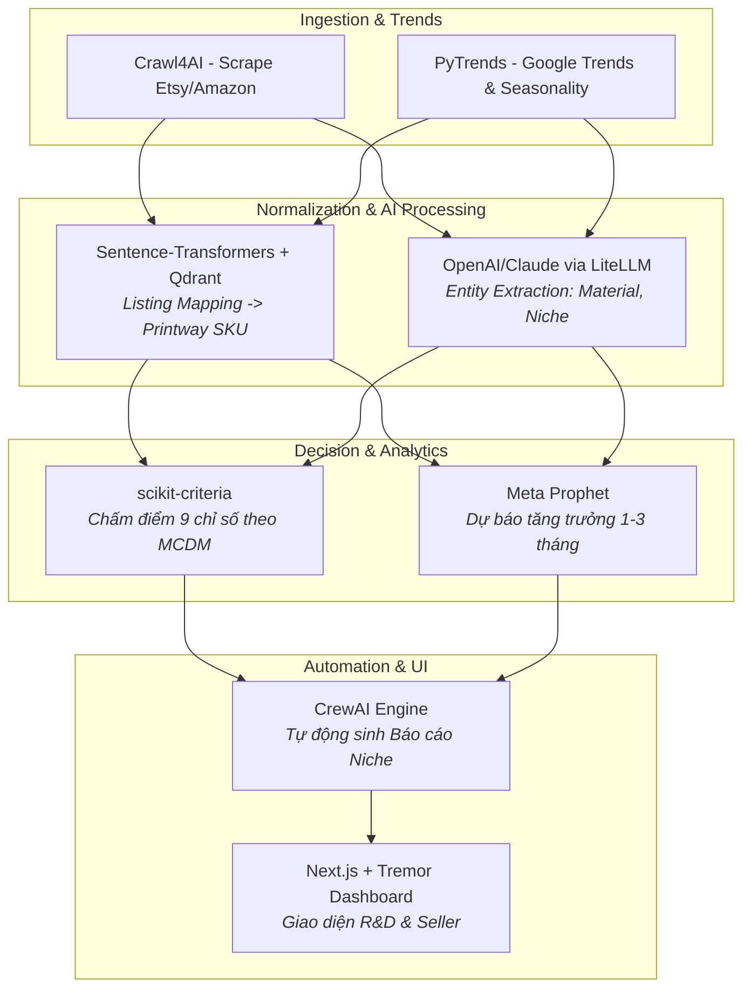

# Báo cáo Nghiên cứu Giải pháp & Open-Source Repositories (Product Opportunity Hub)

> **Mục tiêu:** Rà soát, đánh giá các kho mã nguồn mở (Open-source Repositories) trên thị trường có khả năng giải quyết một phần hoặc toàn bộ bài toán **Product Opportunity Hub** cho ngành Print-On-Demand (POD) / Cross-Border E-Commerce để phục vụ việc fork, tích hợp và customize.

---

## 1. Đánh giá Tổng quan Thị trường Open-Source

* **Hiện trạng:** **Không có một repository duy nhất nào giải quyết 100% "out-of-the-box"** trọn vẹn toàn bộ bài toán này, do bài toán của Printway có tính đặc thù cao của ngành POD (Bộ 9 chỉ số đánh giá, Catalog xưởng in, Listing Mapping từ SEO Name về SKU kỹ thuật).
* **Tuy nhiên:** Đã có các **mã nguồn mở chuyên biệt rất mạnh giải quyết xuất sắc từng module (80-90% khối lượng công việc kỹ thuật)**. Khi kết hợp các repo này lại, chúng ta có thể xây dựng một hệ thống hoàn chỉnh với tốc độ phát triển nhanh gấp 3-4 lần so với việc code lại từ đầu.

---

## 2. Danh sách Repositories Open-Source theo Từng Module

---

### 🌐 Module 1: Thu thập Dữ liệu & Bắt tín hiệu Xu hướng (Data Crawling & Trend Discovery)

| Repository / Thư viện | GitHub / Link | Điểm mạnh & Khả năng Tái sử dụng | Đánh giá Tích hợp |
| :--- | :--- | :--- | :--- |
| **Crawl4AI** *(Khuyên dùng)* | [unclecode/crawl4ai](https://github.com/unclecode/crawl4ai) | • Framework web crawler mã nguồn mở số 1 hiện nay cho AI/LLM. • Tự động trích xuất cấu trúc dữ liệu JSON từ các trang Etsy, Amazon, TikTok, Pinterest mà không bị chặn IP/Cloudflare. • Tốc độ siêu nhanh, xuất Markdown/JSON sạch cho LLM. | **Dùng ngay làm Core Crawler** để cào listing đa nền tảng. |
| **ScrapeGraphAI** | [ScrapeGraphAI/Scrapegraph-ai](https://github.com/ScrapeGraphAI/Scrapegraph-ai) | • Dùng LLM và đồ thị tương tác để tự động trích xuất thông tin sản phẩm mà không cần viết XPath/CSS selector thủ công. • Cực kỳ thích hợp khi cấu trúc HTML của sàn TMĐT thay đổi liên tục. | Sử dụng làm fallback crawler khi sàn đổi giao diện. |
| **PyTrends** | [GeneralMills/pytrends](https://github.com/GeneralMills/pytrends) | • Python API không chính thức cho Google Trends. • Lấy dữ liệu tìm kiếm thời gian thực, độ tăng trưởng từ khóa, tính mùa vụ (Seasonality) theo từng quốc gia (US, UK, CA...). | **Tích hợp trực tiếp** để tính toán chỉ số `Seasonality Fit` và `Market Demand`. |
| **TikTok-Api & Pinterest Scraper** | [davidteather/TikTok-Api](https://github.com/davidteather/TikTok-Api) | • Bắt trend video thịnh hành trên TikTok, tìm kiếm hashtag hot POD (#giftideas, #customgift). | Dùng cho luồng Social Listening. |

---

### 🧠 Module 2: Chuẩn hóa Tên & Ghép nối Danh mục (Product Title Mapping & Entity Extraction)

*Bài toán cốt lõi: Đưa SEO Title `Personalized Grandpa Acrylic Ornament Gift` về SKU `PW-ORN-ACRYLIC`.*

| Repository / Thư viện | GitHub / Link | Điểm mạnh & Khả năng Tái sử dụng | Đánh giá Tích hợp |
| :--- | :--- | :--- | :--- |
| **Shopee / Ecommerce Product Matching** | [cr21/Shopee-Product-Matching](https://github.com/cr21/Shopee-Product-Matching) [Jinal17/Ecommerce-Product-Matching](https://github.com/Jinal17/Ecommerce-Product-Matching) | • Giải pháp Top 1 Kaggle cho bài toán nhận diện sản phẩm tương đồng (Product Matching). • Kết hợp **BERT Text Embeddings** và **Cosine Similarity** để tìm độ trùng khớp giữa các listing dù tiêu đề viết khác nhau. | **Fork & Customize**: Thay dataset bằng danh mục Printway Catalog để tính similarity score giữa Listing cào về và SKU chuẩn. |
| **Shopify Product Taxonomy** | [Shopify/product-taxonomy](https://github.com/Shopify/product-taxonomy) | • Bộ taxonomy phân cấp sản phẩm chuẩn hóa của Shopify (chứa hàng nghìn category chuẩn e-commerce). | Sử dụng làm cấu trúc thư mục Category chuẩn hóa cho hệ thống. |
| **Sentence-Transformers + Qdrant/Chroma** | [UKPLab/sentence-transformers](https://github.com/UKPLab/sentence-transformers) | • Tạo vector embedding cho tên sản phẩm. Đẩy toàn bộ Catalog Printway vào Vector DB (Qdrant/Milvus/ChromaDB). • Khi có listing mới $\rightarrow$ truy vấn Vector Semantic Search để map về SKU gần nhất trong < 10ms. | **Kiến trúc Mapping tối ưu nhất** (Độ chính xác > 90%). |

---

### 📊 Module 3: Bộ Chấm điểm Đa tiêu chí & Ra Quyết định (Scoring & Decision Engine)

| Repository / Thư viện | GitHub / Link | Điểm mạnh & Khả năng Tái sử dụng | Đánh giá Tích hợp |
| :--- | :--- | :--- | :--- |
| **scikit-criteria** *(Khuyên dùng)* | [scikit-criteria](https://github.com/quatrope/scikit-criteria) | • Thư viện Python chuyên giải quyết bài toán Ra quyết định Đa tiêu chí (**MCDA - Multi-Criteria Decision Analysis**). • Hỗ trợ các thuật toán chuẩn quốc tế như **TOPSIS, PROMETHEE, AHP, Weighted Sum**. • Tự động xếp hạng và chấm điểm theo 9 trọng số có thể thay đổi linh hoạt. | **Tích hợp trực tiếp vào Backend** để làm Scoring Engine chuẩn hóa toán học. |
| **pyDecision** | [pyDecision](https://github.com/Valdecy/pyDecision) | • Bộ thuật toán ra quyết định toàn diện cho Python (hơn 40 thuật toán MCDM). | Dự phòng để tinh chỉnh các công thức ranking nâng cao. |

---

### 🤖 Module 4: Khung Tự động hóa Nghiên cứu Đa Agent (Multi-Agent Market Research Framework)

| Repository / Thư viện | GitHub / Link | Điểm mạnh & Khả năng Tái sử dụng | Đánh giá Tích hợp |
| :--- | :--- | :--- | :--- |
| **market-research-crew** *(Khuyên dùng)* | [syed-kaif07/market-research-crew](https://github.com/syed-kaif07/market-research-crew) [VIVPM/market-research-crew](https://github.com/VIVPM/market-research-crew) | • Hệ thống Multi-Agent dựng trên **CrewAI** chuyên cho phân tích thị trường, nghiên cứu đối thủ, chiến lược sản phẩm. • Tự động tìm kiếm web, tổng hợp insight và xuất ra báo cáo `report.md` hoàn chỉnh. • Đã tích hợp sẵn giao diện Streamlit. | **Fork & Customize**: Tùy biến prompt của các Agent thành: *R&D Researcher*, *Fulfillment Evaluator*, *Trend Forecaster*. |
| **langgraph-pm-maestro** | [redis-developer/langgraph-pm-maestro](https://github.com/redis-developer/langgraph-pm-maestro) | • Sử dụng LangGraph để tạo pipeline nghiên cứu thị trường, ma trận tính năng và phân tích đối thủ có kiểm soát trạng thái (Stateful). | Phù hợp nếu muốn kiểm soát chặt chẽ luồng phê duyệt (Human-in-the-loop). |

---

### 📈 Module 5: Dự báo Xu hướng & Dashboard UI (Forecasting & Visualization)

| Repository / Thư viện | GitHub / Link | Điểm mạnh & Khả năng Tái sử dụng | Đánh giá Tích hợp |
| :--- | :--- | :--- | :--- |
| **Prophet (Meta)** | [facebook/prophet](https://github.com/facebook/prophet) | • Thư viện dự báo chuỗi thời gian (Time-series) tối ưu cho dữ liệu có tính mùa vụ (Seasonality) rõ rệt như E-commerce/POD. • Xử lý tốt các đợt peak sale như Q4, Giáng sinh, Mother's Day... | **Dùng làm Core Forecasting Model** cho Module 4.4 trong PRD. |
| **Tremor Dashboard Components** | [tremorlabs/tremor](https://github.com/tremorlabs/tremor) | • Bộ UI component mã nguồn mở (React/Next.js/Tailwind) chuyên dụng cho Analytics, biểu đồ, metrics scorecard. | **Dùng làm Frontend Template** cho Dashboard POH. |

---

## 3. Bản thiết kế Tích hợp Đề xuất (Integration Blueprint)

Thay vì xây dựng lại từ đầu (mất 2-3 tháng), chiến lược tối ưu nhất là **tích hợp và tùy biến theo mô hình kết hợp (Hybrid Assembly)**:

---

## 4. Kế hoạch Tùy biến chi tiết (Customization Roadmap)

### Những phần có thể Tận dụng nguyên bản (0 - 10% code thêm):
1. **Engine thu thập dữ liệu:** Sử dụng `Crawl4AI` kết hợp `PyTrends` - gần như không cần sửa đổi logic lõi, chỉ cần viết schema JSON đầu ra.
2. **Thuật toán chấm điểm:** Dùng `scikit-criteria` cho mô hình TOPSIS/Weighted Sum để xếp hạng các sản phẩm tiềm năng.
3. **Mô hình dự báo:** Dùng `Prophet` để dự báo biểu đồ Seasonality.

### Những phần BẮT BUỘC phải Tùy biến theo Nghiệp vụ Printway (Customization 60 - 80%):
1. **Catalog Embedding Dataset:** Số hóa và nạp toàn bộ danh mục sản phẩm (Catalog) của Printway (hơn 1.000+ SKU) vào Vector Database để làm dữ liệu mẫu so khớp.
2. **Prompt & Logic của Bộ 9 chỉ số:**
   * Cấu hình logic Rule-based kết nối giá vốn (COGS), thời gian sản xuất (Production Time) của từng loại vật liệu (Acrylic, Gỗ, Kim loại, Vải) từ xưởng Printway.
3. **Template Báo cáo R&D:** Tùy biến prompt của `market-research-crew` để xuất ra đúng format đề xuất cho ngành POD (gợi ý chất liệu, kích thước, ngách, thời điểm launch).

---

## 5. Kết luận & Đề xuất Bước tiếp theo

* **Khuyến nghị hành động:** 
  1. Tạo repository dự án với khung Backend **FastAPI** + **Next.js (Tremor)**.
  2. Tích hợp `Crawl4AI` + `PyTrends` để tạo Data Ingestion pipeline.
  3. Cài đặt `sentence-transformers` và nạp mẫu 20-30 SKU Printway để test độ chính xác của **Listing Mapping**.
  4. Triển khai mô hình chấm điểm 9 chỉ số bằng `scikit-criteria`.
