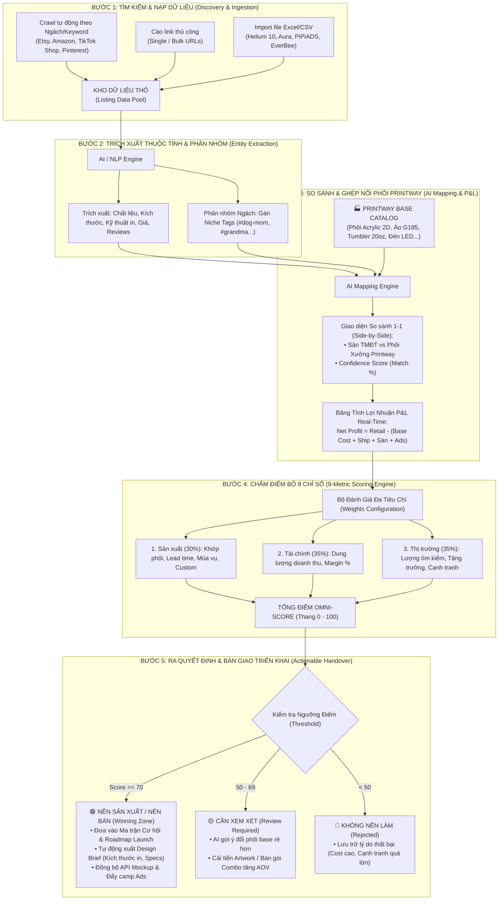

# HƯỚNG DẪN KIẾN TRÚC & LUỒNG VẬN HÀNH R&D (PRODUCT OPPORTUNITY HUB)
*Tài liệu chuẩn hóa quy trình Quản lý Dự án, Tìm kiếm, So sánh, Chấm điểm và Ra quyết định sản phẩm Print On Demand (POD) / Cross-Border E-Commerce*

---

## 1. TỔNG QUAN & TRIẾT LÝ QUẢN TRỊ

Hệ thống **Product Opportunity Hub (POH)** được xây dựng nhằm giải quyết bài toán lớn nhất của ngành POD: **"Thu hẹp khoảng cách giữa Nhu cầu Thị trường (Market Demand) và Năng lực Sản xuất Thực tế (Manufacturing Capability)"**.

### 1.1. Cấu Trúc Phân Cấp Dữ Liệu 3 Tầng (3-Tier Hierarchy)
```
[ 📁 DỰ ÁN R&D (Campaign Project Workspace) ]
   └── [ 🏷️ NGÁCH / TAGS (Niche Clusters) ]
          └── [ 🔍 SẢN PHẨM NGHIÊN CỨU (Research Products) ]
                 ▲
                 └── [ 🔗 GHÉP NỐI VỚI SẢN PHẨM BASE PRINTWAY (Base SKU Mapping) ]
```

### 1.2. Chuẩn Đặt Tên Dự Án (Project Naming Best Practice)
Tên dự án được chuẩn hóa theo bộ 3 yếu tố quản trị dự án: **Thời gian (Time) - Nguồn lực (Scope/Product) - Chất lượng/Thị trường (Market/Target)**:

$$\text{Tên Dự Án} = \mathbf{[\text{Mùa vụ / Năm}]} - \mathbf{[\text{Nhóm Sản Phẩm / Định Hướng}]} - \mathbf{[\text{Thị Trường Mục Tiêu}]}$$

* **Ví dụ tiêu biểu:**
  * `Q4 Holiday 2026 - Ornament & Apparel Blitz - US Market`
  * `Mother's Day 2027 - Drinkware & Acrylic Keepsakes - US/UK`
  * `Evergreen 2026 - Pet Memorial & Dog Breeds - Global`
* **Lợi ích:**
  * Kiểm soát chính xác điểm rơi mùa vụ (Lead time nghiên cứu trước 6-8 tuần).
  * Đo lường được ROI, doanh thu thực tế so với mục tiêu ($ Target Goal).
  * Thực hiện **Post-Mortem Review** (đánh giá ngách nào thành công, ngách nào thất bại và tại sao) để tái sử dụng kinh nghiệm cho các mùa sau.

---

## 2. SƠ ĐỒ LUỒNG HOẠT ĐỘNG TOÀN DIỆN (END-TO-END WORKFLOW)



---

## 3. CHI TIẾT CÁC BƯỚC THỰC HIỆN

### BƯỚC 1: TÌM KIẾM & NẠP DỮ LIỆU (Data Discovery & Ingestion)
1. **Phương thức 1 - Crawl Tự Động Định Kỳ (Auto Crawler):**
   * Người dùng chọn Sàn (Etsy, Amazon, TikTok Shop), nhập Từ khóa ngách (VD: *custom dog ornament*) và Số lượng listing cần lấy (Top 50 - 200).
   * Worker nền tự động cào dữ liệu định kỳ mỗi ngày hoặc theo yêu cầu, tải cache hình ảnh, lọc các listing rác/hết hàng.
2. **Phương thức 2 - Cào Link Thủ Công (Manual URL Scraper):**
   * Dành cho Seller/R&D phát hiện sản phẩm hot bất chợt khi đang lướt mạng xã hội.
   * Dán URL sản phẩm -> Hệ thống bóc tách metadata (Title, Price, Seller, Review, Image) trong 3 giây.
3. **Phương thức 3 - Import Hàng Loạt Từ File Excel / CSV (Bulk Importer):**
   * Hỗ trợ file xuất trực tiếp từ các công cụ spy nổi tiếng: *Helium 10, Shophunter, Aura, PiPiADS, EverBee*.
   * Hệ thống tự động khử trùng lặp (De-duplicate) và tiền xử lý dữ liệu.

---

### BƯỚC 2: TRÍCH XUẤT THUỘC TÍNH & PHÂN NHÓM NGÁCH (NLP & Entity Extraction)
* **Bóc tách thông tin phi cấu trúc:**
  * Listing thực tế: *"Personalized Dog Breed Christmas Acrylic Ornament 2026, 3mm Clear Cut"*
  * Trích xuất:
    * **Loại sản phẩm (Product Type):** *Holiday Ornament*
    * **Chất liệu (Material):** *Optix Acrylic trong suốt 3mm*
    * **Quy cách (Format):** *2D Flat Cut Laser*
    * **Khả năng tùy biến:** *In tên chó + Chọn giống chó (120 giống)*
* **Gán Ngách tự động:** Tự động gắn tag ngách (VD: `#dog-mom`, `#pet-memorial`) để phân nhóm quản lý trong dự án.

---

### BƯỚC 3: SO SÁNH & GHÉP NỐI VỚI BASE PRINTWAY (AI Mapping & P&L Simulator)
* **Khái niệm 2 loại sản phẩm:**
  * **Sản phẩm Base:** Danh mục phôi thực tế của Printway (`PW-ORN-ACRYLIC-2D`, `PW-APPAREL-HOODIE-G185`...) kèm giá gốc (Base Cost), cước vận chuyển (Shipping), thời gian sản xuất (Lead Time) và xưởng (US/VN/EU).
  * **Sản phẩm Nghiên cứu:** Listing thị trường thu thập từ các sàn TMĐT.
* **Giao diện So sánh Đối chiếu 1-1 (Side-by-Side):**
  * Hiển thị trực quan song song giữa Listing thị trường và Phôi xưởng Printway kèm độ khớp AI (Match %).
  * Cho phép R&D đổi sang SKU Base khác (ví dụ: đổi từ gỗ 2 lớp sang Acrylic 2D để tối ưu giá thành).
* **Công thức Mô phỏng Lợi Nhuận (P&L Simulator):**

$$\text{Tổng Chi Phí (Cost Total)} = \text{Base Cost} + \text{Est. Shipping} + (\text{Retail Price} \times \text{Phí Sàn \%}) + \text{Est. Ads Cost (CAC)}$$

$$\text{Lãi Ròng (Net Profit)} = \text{Retail Price} - \text{Tổng Chi Phí}$$

$$\text{Biên Lợi Nhuận (Profit Margin \%)} = \frac{\text{Lãi Ròng}}{\text{Retail Price}} \times 100$$

---

### BƯỚC 4: CHẤM ĐIỂM ĐA TIÊU CHÍ (9-Metric Scoring Engine)
Thuật toán chấm điểm tự động dựa trên **Bộ 9 Chỉ số** thuộc 3 nhóm (Thang điểm 0 - 100):

$$\text{Overall Score} = \sum_{i=1}^{9} \left( \text{Điểm Thành Phần}_i \times \text{Trọng Số}_i \times 10 \right)$$

| Nhóm Tiêu Chí | Chỉ Số Cốt Lõi | Trọng Số Chuẩn | Ý Nghĩa Đánh Giá |
| :--- | :--- | :---: | :--- |
| **I. Khả năng Sản xuất** *(Tổng 30%)* | **1. Production Fit** | 10% | Mức độ tương thích với phôi và máy in có sẵn tại xưởng Printway. |
| | **2. Production Time** | 5% | Lead time in ấn và vận chuyển nội địa (Xưởng US đạt điểm tối đa). |
| | **3. Seasonality Fit** | 10% | Mức độ phù hợp với mùa vụ chiến dịch của Dự án. |
| | **4. Personalization** | 5% | Mức độ dễ dàng khi thiết lập form cá nhân hóa cho khách mua. |
| **II. Hiệu quả Tài chính** *(Tổng 35%)* | **5. Potential Revenue** | 15% | Ước tính quy mô doanh thu thị trường (Search Volume $\times$ AOV). |
| | **6. Profit Margin** | 20% | Biên lợi nhuận ròng sau khi trừ toàn bộ COGS, Ship, Sàn và Ads (&gt; 35% đạt điểm 10). |
| **III. Tiềm năng Thị trường** *(Tổng 35%)* | **7. Market Demand** | 15% | Lượng tìm kiếm hàng tháng và lượt mua thực tế trên các sàn. |
| | **8. Growth Rate** | 10% | Vận tốc tăng trưởng từ khóa và thảo luận mạng xã hội (TikTok, Pinterest). |
| | **9. Competition Level** | 10% | Độ bão hòa listing (Mức cạnh tranh thấp đến trung bình sẽ có điểm cao). |

---

### BƯỚC 5: RA QUYẾT ĐỊNH & BÀN GIAO THỰC THI (Actionable Handover)
1. 🟢 **NÊN SẢN XUẤT / NÊN BÁN (Score $\ge 70$):**
   * Tự động đưa vào **Ma Trận Winning Zone** và **Lộ Trình Launch Roadmap**.
   * **Xuất Design Brief chuẩn:** Kích thước file in ấn (DPI, Pixel template), màu sắc xu hướng, danh sách từ khóa SEO đề xuất cho team Design và Marketing.
2. 🟡 **CẦN XEM XÉT THÊM (Score 50 - 69):**
   * Đưa ra khuyến nghị AI: Thay đổi chất liệu phôi, làm combo 2 sản phẩm hoặc tối ưu lại hình ảnh mockup để nâng giá bán.
3. 🔴 **KHÔNG NÊN LÀM (Score $< 50$):**
   * Lưu vết nguyên nhân (ví dụ: cước ship quá cao, thời gian in ấn quá dài làm trễ mùa vụ) làm dữ liệu bài học cho tương lai.

---

## 4. BẢNG TỔNG KẾT MA TRẬN PHÂN VAI (RACI MATRIX)

| Giai Đoạn | R&D Specialist | Pricing / Operation | Design Team | Marketing / Media Buyer | System (POH AI) |
| :--- | :---: | :---: | :---: | :---: | :---: |
| **1. Khởi tạo Dự án & Ingestion** | **A / R** | C | I | I | **Automated** |
| **2. AI Mapping Base SKU** | **R** | **A** | I | I | **Automated** |
| **3. P&L & Scoring Decision** | **R** | **A** | I | I | **Automated** |
| **4. Tạo Design Brief & Mockup** | I | I | **A / R** | C | **Assisted** |
| **5. Launch Campaign & Scale** | C | I | I | **A / R** | **Tracking** |

*(Ghi chú: **R** = Responsible / Người thực hiện; **A** = Accountable / Người chịu trách nhiệm chính; **C** = Consulted / Người tham vấn; **I** = Informed / Người nhận thông tin)*
